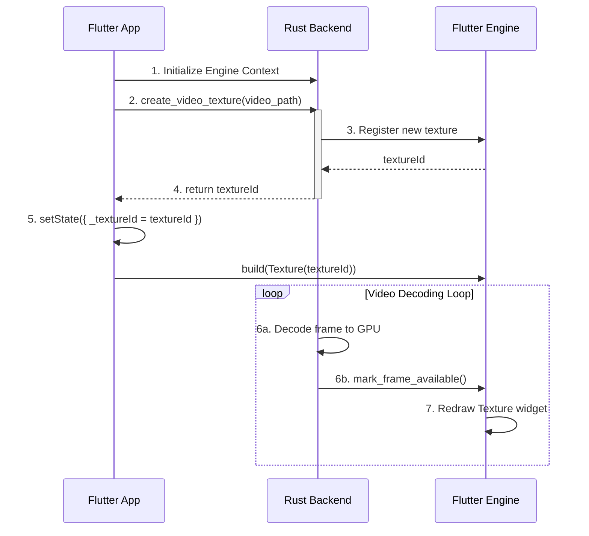

# How to Use `irondash` for Zero-Copy Rust Video Rendering in Flutter

This guide explains how to integrate a Rust-powered video decoder with a Flutter UI using the `irondash` suite of packages. The primary goal is to achieve high-performance, "zero-copy" rendering by sharing GPU texture handles between Rust and Flutter, avoiding the costly process of copying raw pixel data across the FFI boundary.

The key components from `irondash` are:
- **`irondash_engine_context`**: A foundational package that provides the Rust backend with safe access to the Flutter engine's graphics context (e.g., OpenGL, Metal, Vulkan).
- **`irondash_texture`**: A Rust-only crate that uses the engine context to create and manage external textures that can be displayed by Flutter's standard `Texture` widget.

---

## Architecture Overview

The communication and rendering flow is as follows:

1.  **Initialization**: The Flutter app starts and initializes the `irondash_engine_context`, passing the necessary graphics context information to the Rust backend.
2.  **Texture Request**: The Flutter `VideoPlayerWidget` calls a Rust function (via `flutter_rust_bridge`) to start the video decoding and create a texture.
3.  **Texture Creation (Rust)**: The Rust backend uses `irondash_texture` to create a new hardware texture on the GPU and registers it with the Flutter engine. This registration process yields an integer `textureId`.
4.  **ID Communication**: Rust returns the `textureId` back to the Flutter widget.
5.  **Initial Render**: The Flutter widget receives the `textureId`, saves it in its state, and renders a standard `Texture(textureId: ...)` widget. At this point, the texture is likely blank.
6.  **Render Loop (Rust)**: The Rust backend runs its video decoding loop. For each new frame:
    a. It decodes the frame directly into the GPU texture created in Step 3.
    b. It calls `texture.mark_frame_available()` to notify the Flutter engine that the texture has new content.
7.  **UI Refresh**: The Flutter engine, having been notified, automatically redraws the `Texture` widget on the screen, displaying the new frame from the GPU.



---

## Step-by-Step Implementation

### Step 1: Add Dependencies

You must add `irondash` packages as **local path dependencies**. They are not hosted on pub.dev or crates.io.

**In `pubspec.yaml` (Your Main App):**
Note that `irondash_texture` is **not** a Dart package and should not be added here.

```yaml
dependencies:
  flutter:
    sdk: flutter
  # ... other dependencies

  # Provides Rust with access to the Flutter engine's graphics context.
  irondash_engine_context:
    path: ../irondash/engine_context/dart
```

**In `rust/Cargo.toml` (Your Rust Crate):**

```toml
[dependencies]
# ... other dependencies

# Provides Rust with access to the Flutter engine's graphics context.
irondash_engine_context = { path = "../irondash/engine_context/rust" }

# The Rust-only crate for creating and managing Flutter external textures.
irondash_texture = { path = "../irondash/texture" }
```

### Step 2: Initialize Engine Context

In your `main.dart`, before `runApp()`, initialize the context. This must be done once at startup.

```dart
// lib/main.dart
import 'package:irondash_engine_context/irondash_engine_context.dart';
import 'package:your_app/src/rust/api/simple.dart'; // Your FFI bridge

Future<void> main() async {
  WidgetsFlutterBinding.ensureInitialized();

  // Initialize the engine context for the Rust backend
  await IrondashEngineContext.instance.initialize();

  // Initialize your Rust logic (if needed)
  await initRust();

  runApp(const MyApp());
}
```

### Step 3: Create the Texture in Rust

In your Rust API (e.g., `rust/src/api/simple.rs`), create a function that Dart can call to initiate video playback and get a texture ID.

This involves implementing the `PayloadProvider` trait from `irondash_texture`. This example shows a conceptual implementation for a video player.

```rust
// rust/src/video_player.rs
use irondash_texture::{Texture, PayloadProvider, BoxedPixelData};
use irondash_engine_context::EngineContext;
use std::sync::{Arc, Mutex};

// This struct will hold the state of your video player
pub struct MyVideoPlayer {
    // state like frame data, dimensions, etc.
}

impl MyVideoPlayer {
    // A method to get the latest video frame pixels
    fn get_latest_frame(&self) -> Vec<u8> {
        // Your logic to decode a video frame and return its raw RGBA pixels
        vec![0; 1920 * 1080 * 4] // dummy frame
    }
}

// This is the provider that irondash_texture will call to get new frames.
impl PayloadProvider<BoxedPixelData> for MyVideoPlayer {
    fn get_payload(&self) -> BoxedPixelData {
        let frame_data = self.get_latest_frame();
        // For CPU-based texture sharing. For GPU, you'd use platform-specific types.
        SimplePixelData::boxed(1920, 1080, frame_data)
    }
}

// In your FFI API file (e.g., rust/src/api/simple.rs)

// Global state to hold the texture and player
lazy_static::lazy_static! {
    static ref GLOBAL_STATE: Mutex<Option<SendableTexture>> = Mutex::new(None);
}

// This is the function you will call from Dart
pub fn create_video_texture() -> anyhow::Result<i64> {
    let engine = EngineContext::get()?; // Get the engine context

    let player = Arc::new(MyVideoPlayer::new());
    let texture = Texture::new_with_provider(engine.get_handle(), player)?;

    let texture_id = texture.id();

    // Store the texture in a thread-safe way so the render loop can access it
    let sendable_texture = texture.into_sendable_texture();
    *GLOBAL_STATE.lock().unwrap() = Some(sendable_texture);

    // Start your video decoding loop in a new thread
    std::thread::spawn(move || {
        loop {
            // your decoding logic...
            // when a new frame is ready:
            if let Some(texture) = &*GLOBAL_STATE.lock().unwrap() {
                texture.mark_frame_available();
            }
            std::thread::sleep(std::time::Duration::from_millis(16)); // ~60fps
        }
    });

    Ok(texture_id)
}
```

### Step 4: Use the Texture in Flutter

Finally, update your Flutter widget to call the Rust function and use the returned `textureId`.

```dart
// lib/widgets/video_player_widget.dart
import 'package:flutter/material.dart';
import 'package:your_app/src/rust/api/simple.dart'; // Your FFI bridge

class VideoPlayerWidget extends StatefulWidget {
  // ...
}

class _VideoPlayerWidgetState extends State<VideoPlayerWidget> {
  int? _textureId;
  String? _errorMessage;

  @override
  void initState() {
    super.initState();
    _initializePlayer();
  }

  Future<void> _initializePlayer() async {
    try {
      // Call the Rust function to create the texture and start the backend loop
      final textureId = await createVideoTexture();
      if (mounted) {
        setState(() {
          _textureId = textureId;
        });
      }
    } catch (e) {
      if (mounted) {
        setState(() {
          _errorMessage = e.toString();
        });
      }
    }
  }

  @override
  Widget build(BuildContext context) {
    if (_errorMessage != null) {
      return Center(child: Text('Error: $_errorMessage'));
    }
    if (_textureId == null) {
      return const Center(child: CircularProgressIndicator());
    }
    // Use the standard Flutter Texture widget with the ID from Rust
    return Texture(textureId: _textureId!);
  }
}
```
